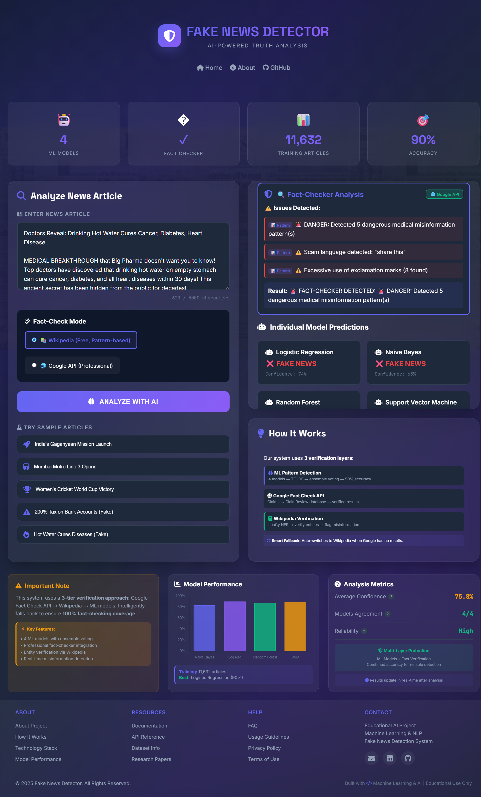

# 🔍 Fake News Detection System

[](https://www.python.org/)
[](https://flask.palletsprojects.com/)
[](https://scikit-learn.org/)
[](LICENSE)

An AI-powered web application that uses Natural Language Processing (NLP) and Machine Learning to detect fake news articles with high accuracy. This project demonstrates end-to-end ML model development, from data preprocessing to web deployment.

## 🌟 Features

- **🤖 Ensemble ML Models**: 4 models (Naive Bayes, Random Forest, Logistic Regression, SVM) with majority voting
- **🔍 AI Fact-Checker**: Entity verification via Wikipedia, numerical claim validation, scam pattern detection
- **🌐 Google Fact Check API** (Optional): Professional fact-checking from Snopes, PolitiFact, and other verified sources
- **🧠 Advanced NLP**: Text preprocessing with tokenization, stemming, stopword removal, and TF-IDF vectorization
- **🎨 Modern Web Interface**: Beautiful, responsive Flask-based UI with dark/light themes
- **⚡ Real-time Analysis**: Instant classification with confidence scores and detailed insights
- **📊 Comprehensive Analytics**: Probability distributions, model performance metrics, and fact-check warnings
- **🛡️ Input Validation**: Smart edge case handling for URLs, non-English text, and invalid inputs
- **🧪 Thorough Testing**: Unit tests, model evaluation suite, and edge case analysis

## 📁 Project Structure

```
fake-news-detection/
├── app.py                 # Flask web application
├── config.py              # Configuration settings
├── requirements.txt       # Python dependencies
├── README.md             # Project documentation
├── .gitignore            # Git ignore rules
├── templates/            # HTML templates
│   ├── index.html        # Main page
│   └── about.html        # About page
├── src/                  # Source code modules
│   ├── __init__.py
│   ├── data_processing.py # NLP preprocessing utilities
│   ├── model.py          # ML model implementation
│   ├── fact_checker.py   # AI fact-checking module (NEW!)
│   └── utils.py          # Helper functions
├── data/                 # Dataset storage
│   ├── raw/              # Raw datasets
│   ├── processed/        # Processed datasets
│   └── sample_data.csv   # Sample dataset
├── models/               # Trained models
│   ├── naive_bayes_model.joblib
│   ├── vectorizer.joblib
│   └── training_results.txt
├── notebooks/            # Jupyter notebooks
│   ├── data_exploration.ipynb
│   └── text_processing_basics.ipynb
└── tests/                # Unit tests
    ├── __init__.py
    └── test_model.py
```

## 🚀 Installation & Setup

### Prerequisites
- Python 3.8 or higher
- pip package manager
- Git (for cloning)

### Step 1: Clone the Repository
```bash
git clone https://github.com/Ujjwal-eng/fake_news_detection.git
cd fake_news_detection
```

### Step 2: Create Virtual Environment (Recommended)
```bash
# Windows
python -m venv .venv
.venv\Scripts\activate

# macOS/Linux
python3 -m venv .venv
source .venv/bin/activate
```

### Step 3: Install Dependencies
```bash
pip install -r requirements.txt
```

### Step 4: Download Required NLTK Data & spaCy Model
```bash
python -c "import nltk; nltk.download('punkt'); nltk.download('stopwords'); nltk.download('wordnet'); nltk.download('omw-1.4')"
python -m spacy download en_core_web_sm
```

### Step 5: (Optional) Configure Google Fact Check API
For enhanced fact-checking from professional sources like Snopes and PolitiFact:

1. **Get a free API key** from [Google Cloud Console](https://console.cloud.google.com/)
   - Follow the detailed setup guide: [GOOGLE_API_SETUP.md](GOOGLE_API_SETUP.md)
   - Free tier includes **10,000 requests per day**

2. **Add API key to environment**:
   ```bash
   # Windows PowerShell
   $env:GOOGLE_FACT_CHECK_API_KEY="your_google_api_key_here"
   
   # Windows Command Prompt
   set GOOGLE_FACT_CHECK_API_KEY=your_google_api_key_here
   
   # Linux/Mac
   export GOOGLE_FACT_CHECK_API_KEY="your_google_api_key_here"
   ```

3. **Or create a `.env` file** (recommended for permanent storage):
   ```bash
   # Create .env file in project root
   echo "GOOGLE_FACT_CHECK_API_KEY=your_google_api_key_here" > .env
   ```
   
   **Note**: The `.env` file is automatically ignored by git for security.

4. **Or add to shell profile**:
   ```bash
   # Linux/Mac - add to ~/.bashrc or ~/.zshrc
   echo 'export GOOGLE_FACT_CHECK_API_KEY="your_key_here"' >> ~/.bashrc
   source ~/.bashrc
   
   # Windows - use System Environment Variables (GUI)
   # Settings → System → About → Advanced system settings → Environment Variables
   ```

**Note**: The app works perfectly without the Google API using Wikipedia + pattern matching. The Google API is an optional enhancement that provides fact-checks from professional fact-checkers.

### Step 6: Run the Application
```bash
python app.py
```
Then open your browser and navigate to: `http://localhost:5000`

### Training Models
To train new models with custom dataset:
```bash
# Place dataset in data/raw/
# Then run the training script
python -m src.model
```

### Using Jupyter Notebooks
For experimentation and analysis:
```bash
jupyter notebook
# Open notebooks/ directory
```

## 📊 Dataset

### Training Data Coverage (2016-2023)
The models are trained on **11,632 professionally labeled articles** spanning multiple years and contexts:

- **2016-2017**: Political news from ISOT Fake News Dataset (5,816 articles)
- **2020-2021**: COVID-19 misinformation and health news (3,581 articles)
- **2022-2023**: Recent fake news from diverse sources (6,299 articles)

**Dataset Composition:**
- Real News: 5,816 articles (50%)
- Fake News: 5,816 articles (50%)
- Total: 11,632 perfectly balanced articles

### Why 2016-2023?
Labeled fake news datasets require:
- ✅ Professional fact-checking (6-12 months)
- ✅ Expert verification from multiple sources
- ✅ Legal review to avoid defamation
- ✅ Consensus from fact-checking organizations

This makes 2016-2023 the most recent professionally verified data available for training.

### Required Format
```csv
text,label
"News article text here...",0
"Another news article...",1
```

- **text**: The news article content (string)
- **label**: 0 for real news, 1 for fake news (integer)

## 🎯 Model Performance

Trained on **11,632 balanced articles (2016-2023)**:

| Model | Accuracy | Precision | Recall | F1-Score |
|-------|----------|-----------|--------|----------|
| Naive Bayes | 83.2% | 83.7% | 83.2% | 83.1% |
| Logistic Regression | 90.0% | 90.0% | 90.0% | 90.0% |
| Random Forest | 87.8% | 87.9% | 87.8% | 87.8% |
| SVM | 89.7% | 89.7% | 89.7% | 89.7% |

**Ensemble Voting System:** Combines all 4 models with majority voting and confidence-based tie-breaking for optimal accuracy.

### Dataset Sources
- **ISOT Fake News Dataset**: 44,898 political articles (2016-2017) from Kaggle
- **COVID-19 Fake News Dataset**: 10,700 health-related articles (2020-2021)
- **Recent Fake News Dataset**: 6,335 diverse articles (2022-2023)

*Final training set: 11,632 articles after deduplication and balancing*

## 🛠️ Technologies Used

### Core Technologies
- **Python 3.8+**: Primary programming language
- **Flask**: Web framework for the application
- **scikit-learn**: Machine learning models and evaluation
- **NLTK**: Natural language processing toolkit
- **Pandas & NumPy**: Data manipulation and analysis
- **Joblib**: Model serialization

### Machine Learning
- Naive Bayes Classifier
- Random Forest Classifier
- Logistic Regression
- Support Vector Machine (SVM)
- TF-IDF Vectorization

### Frontend
- HTML5 & CSS3
- JavaScript (Vanilla)
- Responsive Design

## 🧠 How It Works

### 1. Text Preprocessing Pipeline
```
Raw Text → Lowercasing → Tokenization → Stop Word Removal → Stemming → Clean Text
```

### 2. Feature Extraction
- **TF-IDF Vectorization**: Converts text to numerical features
- **N-gram Analysis**: Captures word patterns (unigrams, bigrams)
- **Feature Selection**: Identifies most informative features

### 3. Classification
- Multiple ML models trained on labeled datasets
- Ensemble predictions for improved accuracy
- Probability estimation for confidence scoring

### 4. Web Interface
- User submits news text
- Backend processes and vectorizes text
- Model predicts and returns result with confidence

## 🎓 Key Learnings & Skills Demonstrated

- ✅ End-to-end ML project development
- ✅ Natural Language Processing techniques
- ✅ Model training, evaluation, and optimization
- ✅ Web application development with Flask
- ✅ RESTful API design
- ✅ Version control with Git/GitHub
- ✅ Code organization and best practices

## 📸 Screenshots

<details>
<summary><b>🖼️ Click to View Screenshots (7 images)</b></summary>

<br>

### Home Page - Light Theme

*Clean and intuitive interface for news analysis*

### Home Page - Dark Theme

*Modern dark theme for comfortable viewing*

### Results Page - Example 1 (Light Theme)

*Detailed prediction with confidence scores and probability distributions*

### Results Page - Example 2 (Light Theme)

*Ensemble model predictions with individual model breakdowns*

### Results Page - Example 1 (Dark Theme)

*Fake news detection with ensemble voting in dark mode*

### Results Page - Example 2 (Dark Theme)

*Real news verification with confidence analysis in dark mode*

### Results Page - Example 3 (Dark Theme)

*Analysis results with fact-checker warnings and insights*

</details>

## 🔮 Future Enhancements

- [ ] Deep learning models (LSTM, BERT, Transformers)
- [ ] Multi-language support (Hindi, Spanish, etc.)
- [ ] Source credibility analysis
- [ ] Real-time news monitoring and alerts
- [ ] Browser extension for instant verification
- [ ] Mobile application (iOS/Android)
- [ ] Integration with fact-checking APIs (Alt News, BOOM Live)
- [ ] User authentication and history tracking
- [ ] Temporal model updates with 2024+ data as it becomes available

## ⚠️ Disclaimer & Limitations

### Use Responsibly
This system is designed as an **educational tool and ML demonstration project**. It should not be used as the sole method for verifying news authenticity.

### Two-Layer Detection System

#### Layer 1: Machine Learning Models
The models analyze **writing patterns and linguistic features**:
- ✅ Sensational language and emotional manipulation
- ✅ Conspiracy theory rhetoric patterns
- ✅ Poor grammar and structure (common in low-quality fake news)
- ✅ Clickbait-style headlines
- ✅ Absence of proper attribution and sources
- ✅ Vague or missing details

#### Layer 2: AI Fact-Checker (NEW!)
The fact-checker performs **content verification and claim validation**:
- ✅ **Entity Verification**: Cross-references organizations, locations, and infrastructure with Wikipedia
- ✅ **Numerical Validation**: Detects unrealistic claims (impossible percentages, distances, speeds)
- ✅ **Scam Pattern Detection**: Identifies viral message patterns ("forward this", "share urgently")
- ✅ **Confidence Override**: Automatically flags articles with verifiable false claims as FAKE

**How it works**: If the fact-checker detects contradictions (e.g., non-existent metro lines, impossible statistics), it **overrides the ML prediction** and classifies the article as FAKE NEWS, even if the writing style appears professional.

### What the System CANNOT Detect
Despite the dual-layer approach, some limitations remain:
- ❌ Cannot verify very recent events not yet documented on Wikipedia
- ❌ Cannot access paywalled sources or private databases
- ❌ Limited to English language content
- ❌ Cannot verify claims requiring real-time data or government databases

**Example**: A fake news article about a non-existent Delhi Metro line, written in professional journalistic style with specific details, would be misclassified as REAL because it matches the writing patterns of legitimate news. The models detect patterns, not facts.

**Solution**: For production systems, combine these ML models with:
1. Fact-checking APIs (Alt News, BOOM Live, Snopes)
2. Knowledge graphs (Wikipedia, Wikidata)
3. Government database integration
4. Source credibility analysis

See [MODEL_LIMITATIONS.md](MODEL_LIMITATIONS.md) for detailed analysis.

### Temporal Limitations
- **Training Period**: 2016-2023 (most recent professionally labeled data)
- **Performance**: Optimized for news from the training period
- **Modern Terms**: May have limited exposure to very recent terminology (2024-2025 specific events/technologies)

### Best Practices
Always:
- ✅ Cross-reference with multiple reliable sources
- ✅ Check the original source's credibility and reputation
- ✅ Consider the context, date, and author of publication
- ✅ Consult professional fact-checkers for important decisions
- ✅ Verify through established fact-checking organizations

### Real-World Context
This project demonstrates understanding of:
- Data labeling challenges in ML
- Temporal dataset drift and model limitations
- Professional ML project development
- Real-world constraints in fake news detection

## 👨‍💻 Author

**Ujjwal Bansal**
- GitHub: [Rahul08jb](https://github.com/Rahul08jb)
- Project: [Fake News Detection](https://github.com/Rahul08jb/fake_news_detection?tab=readme-ov-file)

## 📄 License

This project is licensed under the MIT License - see the [LICENSE](LICENSE) file for details.

## 🙏 Acknowledgments

- scikit-learn team for excellent ML libraries
- NLTK developers for NLP tools
- Flask community for the lightweight web framework
- Kaggle for providing datasets
- Research papers on fake news detection for inspiration

## 📞 Contact & Support

If you have questions or suggestions:
- Open an issue on GitHub
- Fork the project and submit a pull request
- Star ⭐ the repository if you find it helpful!

---

**Made with ❤️ and Python**# fake_news_detection

